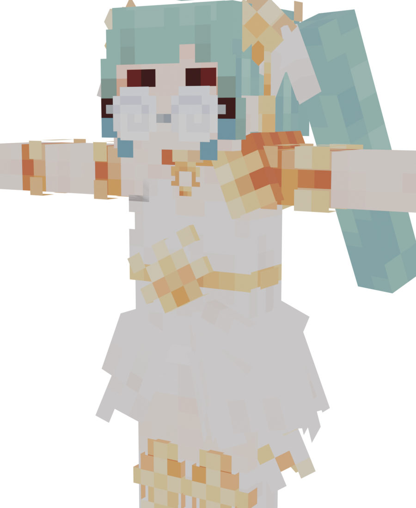

# figura2vrc — Figura → VRChat avatar conversion pipeline



Converts a [Figura](https://github.com/FiguraMC/Figura) (Blockbench) Minecraft
player avatar into a working VRChat avatar: a rigid-limb Unity-Humanoid rig,
PhysBones-ready skeleton, and in-game expression toggles built from the
model's Blockbench animations.

Debugged end to end on real conversions (two avatars and counting) — the docs
include every pitfall hit along the way so you don't have to rediscover them,
plus a per-part PhysBones tuning table and a checklist for adapting the
pipeline to a new avatar.

## Quickstart

```powershell
# 0. In Blockbench: File > Export > Export glTF  ->  model.gltf (with animations)

# 1. From your avatar folder (the one containing model.gltf):
blender --background --python path\to\figura2vrc\convert_to_vrchat.py
#    options after "--", e.g.:
#    ... convert_to_vrchat.py -- --height 1.6 --front-marker FrontHair --lift LeftBrow=0.5

# -> writes vrchat_export\ next to the glTF: avatar.fbx, textures, previews,
#    avatar_rigged.blend, convert_report.json

# 2. In your VRChat Unity project (Creator Companion, Avatars SDK):
#    copy avatar.fbx twice: Assets/avatar.fbx and Assets/avatar_anims.fbx,
#    plus the textures. Follow docs/CONVERSION.md for import settings.

# 3. Copy unity/FiguraExpressionSetup.cs into Assets/Editor/, adjust its
#    config block, then: Tools > Figura Avatar > Setup Expressions.
```

Full walkthrough — Unity import settings, humanoid mapping pitfalls,
materials, PhysBones, publishing, and the troubleshooting table — in
**[docs/CONVERSION.md](docs/CONVERSION.md)**.

## Layout

| Path | What |
|---|---|
| `convert_to_vrchat.py` | Blender headless converter: glTF → T-posed humanoid FBX |
| `unity/FiguraExpressionSetup.cs` | Unity editor script: FX animator, auto-blink, expressions menu |
| `docs/CONVERSION.md` | The full conversion guide + troubleshooting |

## Requirements

- Blockbench (glTF export with animations)
- Blender 4.2+ (developed on 5.2), used headless
- Unity 2022.3 via VRChat Creator Companion with the Avatars SDK
- The model must use the vanilla player bone names
  (`Head`, `Body`, `LeftArm`, `RightArm`, `LeftLeg`, `RightLeg`) — every
  standard Figura player avatar does.

## Notes

- `LIFT_PIXELS` in the converter holds per-model cosmetic offsets (the
  original avatar needed its brow bars raised half a pixel clear of its
  glasses). It silently no-ops for models without those bones; override or
  clear it via `--lift`.
- Output is PC-targeted (`Unlit/Transparent Cutout` materials). For a
  Quest/Android build, re-shader with `VRChat/Mobile/*` equivalents.
